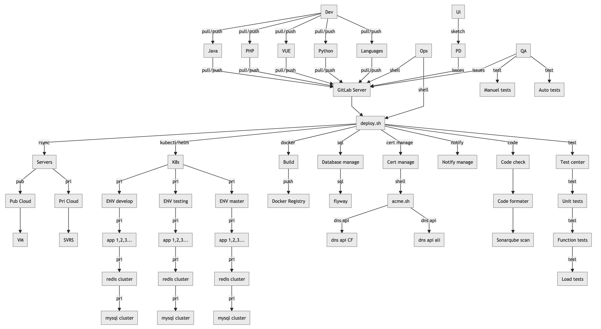

# deploy.sh for GitLab CI/CD：

deploy.sh is a CI/CD program for GitLab Server.
# Description
* support aliyun,qcloud,AWS
* support rsync file
* support docker build image,
* support code format check (PHP，Java，Vue，Dockerfile)
* call [acme.sh](https://github.com/acmesh-official/acme.sh.git) update ssl cert
* call Unit test
* call function test
* call Sonarqube scan
* call performance test, stress test, (jmeter)
* Node: deploy docker image with NFS, rsync file to NFS
* Node: run npm/yarn using docker image
* Node: docker run image
* Java: package with maven/gradle, and rsync jar/war file
* Java: deploy docker image
* PHP: rsync file
* PHP: docker run composer and rsync file
* PHP: deploy docker image
* deploy to k8s
* deploy to k8s using helm3
* send message of deploy result with work-weixin, Telegram, Element(Matrix)

# Installing
`git clone https://github.com/xiagw/deploy.sh.git $HOME/gitlab-runner`

# Quick Start
1. Prepare a server
1. Install gitlab-runner, register to gitlab-server, and start gitlab-runner

1. cd $HOME
1. git clone https://github.com/xiagw/deploy.sh.git 1. gitlab-runner
1. cd gitlab-runner
1. cp deploy.conf .deploy.conf  ## change to your 1. configuration
1. cp deploy.env .deploy.env  ## change to your 1. configuration
1. Refer to .gitlab-ci.yaml of this project, setup yours


# Actual case
1. There is already a server gitlab (if not, you can refer to [xiagw/gitlab-docker](https://github.com/xiagw/docker-gitlab) to start one with docker-compose)
1. There is already a server that has installed gitlab-runner, (executer is shell)
1. The ssh key file has been prepared, and you can log in to the target server without a password from the gitlab-runner server (the id_rsa file can be in $HOME/.ssh/, or in the deploy.sh/ directory)
1. Log in to the gitlab-runner server and execute
```shell
git clone https://github.com/xiagw/deploy.sh.git $HOME/gitlab-runner
```
1. Refer to the deploy.conf/deploy.env, modify the file
```shell
cd gitlab-runner
cp deploy.conf .deploy.conf
cp deploy.env .deploy.env
```
1. For example: created projectA under the root account (root/projectA)
1. Create .gitlab-ci.yml (refer to ME)
1. Submit and push
1. Enjoy CI/CD

# 以下显示图片需要 mermain 支持


```mermaid
graph TB;

Dev -- pull/push --> Java;
Dev -- pull/push --> PHP;
Dev -- pull/push --> VUE;
Dev -- pull/push --> Python;
Dev -- pull/push --> other[Languages];
Java -- pull/push --> git;
PHP -- pull/push --> git;
VUE -- pull/push --> git;
Python -- pull/push --> git;
other -- pull/push --> git;
Ops -- shell --> git;
git --> CI[deploy.sh];
Ops -- shell --> CI;
UI -- sketch --> PD;
PD -- issues --> git[GitLab Server];
QA -- issues--> git;
QA -- test--> testm[Manuel tests];
QA -- test--> testauto[Auto tests];
CI -- rsync --> Servers;
CI -- kubectl/helm --> K8s;
CI -- docker --> Build;
CI -- sql --> db1[Database manage];
CI -- cert manage --> cert[Cert manage];
CI -- notify --> notify[Notify manage];
db1 -- sql --> flyway;
cert -- shell --> acme[acme.sh];
acme -- dns api --> dns1[dns api CF];
acme -- dns api --> dns2[dns api ali];
CI -- code --> rev[Code check];
CI -- test --> test[Test center];
test -- test --> testu[Unit tests];
testu -- test --> testf[Function tests];
testf -- test --> testl[Load tests];
rev --> format[Code formater];
format --> sonar[Sonarqube scan];
Build -- push --> Repo[Docker Registry];
Servers -- pub --> Cloud-x[Pub Cloud];
Cloud-x --> mx[VM];
Servers -- pri --> own[Pri Cloud];
own --> my[SVRS]
K8s -- pri --> ENV_D[ENV develop];
K8s -- pri --> ENV_T[ENV testing];
K8s -- pri --> ENV_M[ENV master];
ENV_D -- pri --> app_d[app 1,2,3...];
app_d -- pri --> cache_d[redis cluster];
cache_d -- pri --> db_d[mysql cluster];
ENV_T -- pri --> app_t[app 1,2,3...];
app_t -- pri --> cache_t[redis cluster];
cache_t -- pri --> db_t[mysql cluster];
ENV_M -- pri --> app_m[app 1,2,3...];
app_m -- pri --> cache_m[redis cluster];
cache_m -- pri --> db_m[mysql cluster];
```
